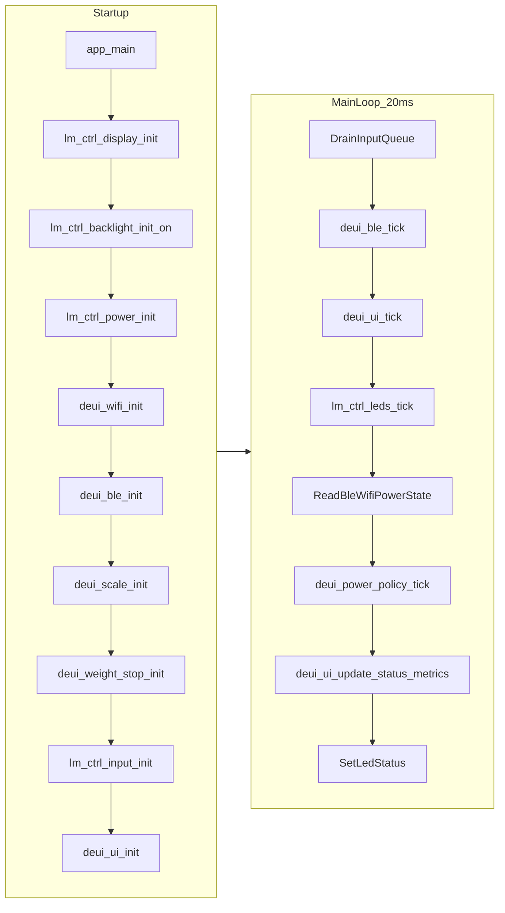

# DEUI Codebase Guide

This guide is for senior engineers reviewing or extending the DEUI controller firmware. It focuses on where behavior lives, how runtime data flows, and what to validate in code review.

## 1) Runtime architecture

Primary runtime entrypoint is `firmware/esp32/main/app_main.c`.

- Initializes hardware and subsystems in this order: display, backlight, power, Wi-Fi setup stack, DE1 BLE client, scale client, weight-stop policy, rotary input queue, optional LED/haptic drivers, then UI.
- Runs a continuous loop (20 ms delay) that:
  - drains rotary input events
  - advances BLE, UI, and LED periodic work
  - collects BLE/Wi-Fi/power state
  - pushes state + metrics into UI
  - updates LED ring status for setup/connecting/connected

## 2) Firmware module map (`firmware/esp32/main`)

Build registration is in `firmware/esp32/main/CMakeLists.txt`.

- `app_main.c`
  - orchestration loop and subsystem wiring
- `board/board_config.h`
  - board pin map and electrical assumptions for ST77916/CST816 + ring + battery + LEDs
- `board/board_display.c`, `board/board_backlight.c`, `board/board_power.c`, `board/board_haptic.c`, `board/board_leds.c`
  - hardware-facing drivers and status primitives used by runtime/UI
- `input/input.c` / `input/input.h`
  - physical ring input polling and queue event production
- `net/wifi_setup.c` / `net/wifi_setup.h`
  - local setup AP/captive-portal flow and STA connectivity state surfaced as `deui_wifi_info_t`
- `ble/deui_ble_client.c` / `ble/deui_ble_client.h`
  - DE1-centric NimBLE central integration and user-facing BLE status payload (`deui_ble_status_t`)
- `ble/deui_ble_gap.c`, `ble/deui_ble_gatt.c`, `ble/deui_ble_state.c`, `ble/deui_ble_parse.c`, `ble/deui_ble_internal.h`
  - BLE split modules for GAP, GATT helpers, DE1 state naming/label logic, shot-sample decoding, and internal helper contracts
- `ble/deui_scale_client.c`, `ble/deui_weight_stop.c`
  - scale telemetry integration and weight-based stop policy hooks
- `brew/deui_shot_metrics.c`
  - live and post-shot metric aggregation
- `power/deui_power_policy.c`
  - power/idle policy decisions used by the main loop
- `ui/deui_ui.c` / `ui/deui_ui.h`
  - LVGL shell: status routing, ring overlay, tick, and top-level orchestration
- `ui/deui_ui_metrics.c`, `ui/deui_ui_widgets.c`, `ui/deui_ui_internal.h`
  - shared metric rendering utilities and widget/theme helper routines
- `ui/deui_ui_priv.h`
  - **internal** shared symbols for UI translation units only (`deui_ui_obj_machine_state`, label helper)
- `ui/deui_ui_screens.h` plus one file per product mode (same physical screen; mode toggles visibility/chrome):

  Splitting these modes into separate `.c` files is optional housekeeping: runtime cost is unchanged, but each file gives a clear home for mode-specific copy/layout without growing a single megafunction. Shared widget ownership and `esp_lv_adapter_lock()` remain in `deui_ui.c`; `deui_ui_priv.h` is intentionally **not** for other subsystems.

  - `ui/screens/deui_ui_screen_searching.c` — disconnected / scanning headline (`Searching`)
  - `ui/screens/deui_ui_screen_idle.c` — connected, not extracting (center label from BLE)
  - `ui/screens/deui_ui_screen_brewing.c` — espresso pull (headline hidden; capsule + metrics driven from `ui/deui_ui.c`)
  - `ui/screens/reference/deui_ui_screen_status.c` — legacy reference screen; intentionally excluded from build
- `ui/deui_theme.h`
  - DEUI color palette tokens used by UI rendering
- fonts from `fonts/` (for example `LabGrotesque_Regular_16.c`, `LabGrotesque_Bold_48.c`)
  - included directly by relative path in CMake; this is intentional path coupling between repo root and firmware target

## 3) BLE stack boundaries

There are two layers to understand:

- Application BLE integration
  - `firmware/esp32/main/ble/deui_ble_client.c`
  - owns DE1 service/characteristic UUID usage, status model, scan/connect/discovery lifecycle
- Peer/service discovery helper component
  - `firmware/esp32/components/deui_nimble_cent` (`peer.c`, `misc.c`, `esp_central.h`)
  - thin helper layer around NimBLE peer/service/characteristic discovery

Protocol reference for characteristic semantics and state enums:

- `docs/de1-bluetooth-protocol.md`

## 4) Build, flash, and tooling

- Project root for firmware target: `firmware/esp32`
- IDF project declaration: `firmware/esp32/CMakeLists.txt` (project name `deui_nano`)
- Primary developer script: `firmware/esp32/dev.sh`
  - `full`: full flash + monitor (first flash / partition changes)
  - `quick`: app-flash + monitor (iterative loop)
  - `build`, `flash`, `monitor`, `erase`, `clean`, `menuconfig`, `ports`
- Operator docs:
  - `docs/controller/FLASHING_CONTROLLER.md`
  - `docs/controller/SETUP_GUIDE.md`

Test note:

- `dev.sh test` expects `firmware/esp32/tests/host/run.sh`.
- In this checkout, `firmware/esp32/tests/` is not present, so the command currently fails unless that host test tree is added.

## 5) Archived/non-canonical code paths

Legacy trees are now under `archive/`:

- `archive/arduino-prototype/` (former repo-root `main/`)
  - includes `main.ino`, `de1_ble_client.cpp`, and related LCD/touch support files
- `archive/lvgl-v8/` (former `lib/lvgl/`)
  - vendored LVGL snapshot kept for reference only

The canonical firmware build remains `firmware/esp32` and depends on IDF-managed components (`managed_components/`).

## 6) Senior review checklist

When reviewing firmware PRs, validate the following first:

- New source files are registered in `firmware/esp32/main/CMakeLists.txt` (or relevant component CMake).
- Pin changes in `firmware/esp32/main/board/board_config.h` match physical board wiring and do not conflict with strapping/critical pins.
- BLE changes preserve thread-safety/lifecycle assumptions between NimBLE callbacks and `deui_ble_tick`.
- UI refactors: keep `deui_ui_screen_*.c` limited to mode-specific visibility/text; shared widgets and `esp_lv_adapter_lock` discipline stay in `deui_ui.c`.
- Wi-Fi setup changes keep AP/captive behavior coherent with `docs/controller/SETUP_GUIDE.md`.
- Any feature that changes boot/flash/partitions is documented in flashing/setup docs.

## 7) Suggested reading order for onboarding

1. `firmware/esp32/README.md`
2. `firmware/esp32/main/app_main.c`
3. `firmware/esp32/main/board/board_config.h`
4. `firmware/esp32/main/ble/deui_ble_client.c`
5. `firmware/esp32/main/ui/deui_ui.c` and the `firmware/esp32/main/ui/screens/deui_ui_screen_*.c` modes
6. `docs/de1-bluetooth-protocol.md`
7. `docs/controller/SETUP_GUIDE.md`
